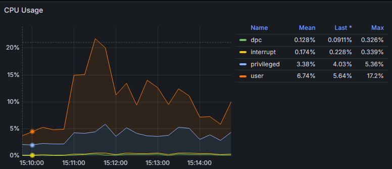

To interpret the CPU usage graph you've provided, we can analyze the various components and what they indicate about your system's performance. Here's a breakdown of how to analyze this specific graph:

### CPU Usage Graph Analysis

1. **Overall Usage Trend**:

   - The graph shows CPU usage over time, specifically from 15:10:00 to 15:14:00. During this period, CPU usage spikes at certain intervals, indicating varying loads on the CPU.
   - Observe the peaks: The highest CPU usage occurs around 15:11:00, where the user and privileged CPU usage rise significantly. This may correlate with a specific application workload or process running during that time.
2. **User CPU Time**:

   - The user CPU time is represented in orange. It averages around **6.74%** and peaks at **17.2%**.
   - A notable increase in user CPU time suggests that user-level applications are consuming more CPU resources, which could indicate higher activity or processing demands from applications.
3. **Privileged CPU Time**:

   - The privileged CPU time, represented in brown, averages **3.38%** and shows peaks as well.
   - This metric indicates the amount of CPU time spent on kernel-level operations. If this value is high relative to user time, it might indicate that system-level processes or services are active, which could suggest overhead in managing hardware interactions.
4. **DPC and Interrupts**:

   - The DPC (Deferred Procedure Calls) is shown in green, and interrupts in yellow. Both values are quite low (below **0.5%**).
   - Low DPC and interrupt times indicate that the system is handling hardware requests efficiently, and there are no significant hardware or driver issues impacting CPU performance.
5. **Interrupt Rate**:

   - The average interrupt rate of **0.174%** suggests that the system is effectively handling interrupts without significant CPU load, which is a good sign for system performance.

### Conclusions and Recommendations

1. **Spikes and Trends**:

   - The significant spikes in user CPU time might need further investigation to identify the applications causing this load. Check logs or application performance metrics during those peak times to see if specific actions correlate with high CPU usage.
2. **Resource Optimization**:

   - If the user processes continue to exhibit high CPU usage consistently, consider optimizing those applications or scaling resources as necessary. Look for opportunities to improve performance, such as code optimizations or resource allocation changes.
3. **Monitor Performance**:

   - Regularly monitor CPU usage trends to establish baselines. Setting alerts for unusual spikes in CPU usage can help proactively manage performance issues.
4. **Capacity Planning**:

   - Use historical data to inform capacity planning. If user CPU usage is trending upward, consider whether additional resources or optimizations are necessary to support application demands.

### Final Note

Overall, understanding CPU usage is crucial for maintaining system performance. This graph provides insight into how your system's resources are allocated and whether any issues might need addressing. Continuously monitoring and analyzing CPU usage helps ensure that the system runs efficiently and effectively meets the demands placed upon it.
