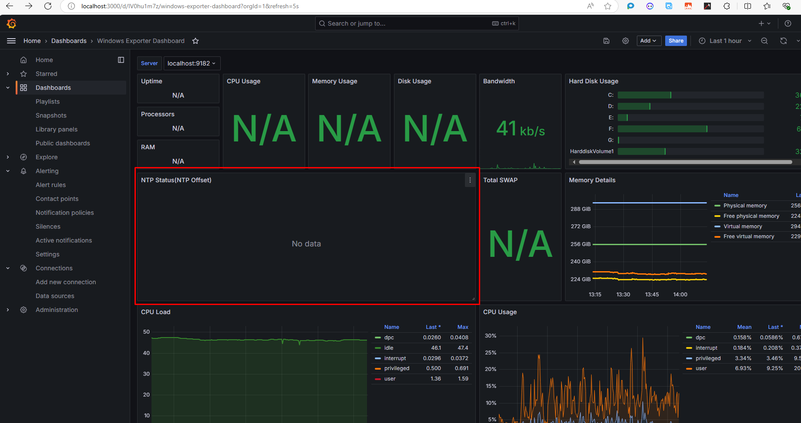

If you're trying to monitor NTP (Network Time Protocol) status using Prometheus and Grafana but finding that the query `windows_time_computed_time_offset_seconds{instance="$server"}` isn't returning any data, here are some troubleshooting steps you can take to resolve the issue:

### 1. **Check Windows Exporter Configuration**

Ensure that the **Windows Exporter** (formerly known as **WMI Exporter**) is properly configured and running on the target server. This exporter collects metrics from Windows systems, including NTP status.

- **Installation:** Make sure that the Windows Exporter is installed correctly on the server. You can download it from the [Windows Exporter GitHub repository](https://github.com/prometheus-community/windows_exporter).
- **Service Status:** Verify that the Windows Exporter service is running. You can check this by running the following command in the Command Prompt or PowerShell:

  ```powershell
  Get-Service windows_exporter
  ```

### 2. **Verify Metrics Endpoint**

Confirm that the metrics endpoint for the Windows Exporter is accessible from the machine where Prometheus is running.

- **Default Metrics Endpoint:** Typically, the default metrics endpoint is located at `http://<server_ip>:9182/metrics`. You can access this URL in your web browser or use a tool like `curl` or Postman to see if the metrics are being served correctly.

### 3. **Check Prometheus Configuration**

Ensure that your Prometheus configuration is correctly set to scrape metrics from the Windows Exporter.

- **Prometheus Configuration File (prometheus.yml):** Verify that the target is correctly specified in your `prometheus.yml`. For example:

  ```yaml
  scrape_configs:
    - job_name: 'windows_exporter'
      static_configs:
        - targets: ['<server_ip>:9182']
  ```
- **Reload Prometheus:** After making changes to the `prometheus.yml` file, you need to reload the configuration. You can do this by sending a `SIGHUP` signal to the Prometheus process or using the web UI to trigger a reload.

### 4. **Check NTP Configuration**

Make sure that the NTP service is running correctly on your Windows server.

- **NTP Client Configuration:** Confirm that your Windows server is configured to use an NTP server. You can check the NTP configuration using the command:

  ```powershell
  w32tm /query /status
  ```
- **Firewall Settings:** Ensure that the firewall settings on the Windows server are not blocking the NTP traffic. NTP uses UDP port 123, so make sure it is open.

### 5. **Check Metric Availability**

If the configuration seems correct, check if the specific metric `windows_time_computed_time_offset_seconds` is available in the metrics exposed by the Windows Exporter.

- **List Available Metrics:** Go to the metrics endpoint (`http://<server_ip>:9182/metrics`) and search for `windows_time_computed_time_offset_seconds`. If it is not listed, there may be an issue with how the Windows Exporter is collecting or exposing this metric.

### 6. **Use Alternative Metrics**

If you don't see the specific metric you are looking for, consider using alternative metrics provided by the Windows Exporter related to time synchronization.

### 7. **Review Logs for Errors**

Check the logs of both Prometheus and Windows Exporter for any error messages that could provide insights into what might be going wrong.

- **Windows Exporter Logs:** Look for logs in the Event Viewer under the `Windows Logs` section or check any configured logging mechanism in the exporter.
- **Prometheus Logs:** Review the logs for any errors related to scraping or connectivity.

### Summary

By following these troubleshooting steps, you should be able to diagnose why `windows_time_computed_time_offset_seconds{instance="$server"}` is not returning any data. Ensuring proper configuration of the Windows Exporter, Prometheus, and the NTP service is key to resolving the issue.
