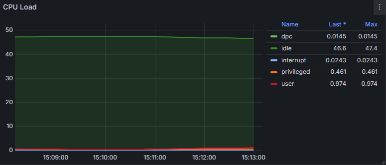

Interpreting the CPU load graph you've provided can give you valuable insights into the performance and efficiency of your system's CPU. Here's a breakdown of the key elements in the graph and how to analyze them:

### Overview of the Graph

The graph titled **"CPU Load"** shows various CPU metrics over a period of time, specifically from **15:07:00 to 15:11:00**. The metrics represented include:

1. **dpc (Deferred Procedure Calls)**: Represents the amount of time spent processing deferred procedure calls.
2. **idle**: Indicates the percentage of time the CPU is idle and not doing any work.
3. **interrupt**: The time spent handling interrupts.
4. **privileged**: Time spent executing in kernel mode, typically for system-level processes.
5. **user**: The time spent on user processes, which are the applications running on the system.

### Key Metrics Interpretation

1. **Idle Time (46.9%)**:

   - This value is significant as it shows that the CPU is idle for a large portion of the time. An idle percentage of 46.9% indicates that the CPU is not under heavy load, which can be a good sign for system performance if your workload does not require constant high utilization.
   - If the idle time is consistently high, it may suggest that the system is underutilized or that the workload is not demanding enough for your CPU capabilities.
2. **User Time (0.686)**:

   - This indicates that a small amount of CPU time is being used for user-level applications. Since this value is low compared to idle time, it suggests that user processes are not consuming a significant amount of CPU resources.
   - This can be interpreted as the applications running on the system are not CPU-intensive.
3. **Privileged Time (0.379)**:

   - This value shows the time the CPU is executing system-level tasks. Again, this value is relatively low, indicating that the system’s kernel processes are not heavily impacting performance.
4. **DPC and Interrupt Times**:

   - Both DPC (0.00718) and Interrupt (0.0197) times are also low, indicating that the system is effectively handling hardware interrupts and deferred procedure calls without any significant delay.

### Overall Interpretation

- **Stable Performance**: The overall CPU load is quite low, suggesting that your system is not under stress and is operating efficiently. The low values in user, privileged, DPC, and interrupt metrics indicate that the CPU has plenty of capacity to handle additional workloads.
- **Underutilization Considerations**: If your system is expected to handle heavier workloads and you're seeing this level of CPU utilization, it might indicate that the applications are not demanding enough resources, or there could be inefficiencies in how resources are allocated.
- **Potential for Additional Workloads**: With a significant amount of idle time, you could consider scaling your applications or adding more tasks to make full use of the available CPU resources without affecting performance.

### Conclusion

In conclusion, this CPU load graph indicates that your system is running smoothly with low CPU utilization. The CPU is primarily idle, and the active usage metrics (user, privileged, interrupt, DPC) are also low, suggesting that your system is not under any stress. If your workloads increase or if you anticipate higher demand, you have ample capacity to manage additional tasks. Monitoring these metrics over time will help ensure your system remains efficient and responsive to changing workloads.
