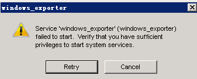

# Service Cannot Start

The image displays an error message indicating that the "windows_exporter" service failed to start. This type of error typically occurs when you do not have sufficient privileges to start system services. Here are some steps you can take to resolve this issue:

Solution Steps

1. **Run as Administrator:**

   - To start the "windows_exporter" service, you need to have the necessary permissions. Try running the application or command that attempts to start the service as an administrator. Right-click on the application shortcut and select "Run as administrator."
2. **Check Service Status:**

   - Open the "Services" application (services.msc) to check the status of the "windows_exporter" service. If it is stopped, try to start it manually.
   - Additionally, verify the configuration settings of the service. An incorrectly configured service might fail to start.
3. **Use Event Viewer:**

   - Use Windows Event Viewer to check for more information about this service. Navigate to "Windows Logs" > "System" to find logs related to the service and any specific error messages.
4. **Check for Updates:**

   - Ensure that Windows is up to date. If there are any pending updates, install them as they may resolve compatibility issues.
5. **Antivirus or Firewall:**

   - Sometimes, antivirus software or firewall settings can prevent services from running. Try temporarily disabling any such software and see if that allows the service to start.
6. **Reinstallation:**

   - If the above steps do not resolve the issue, consider uninstalling and then reinstalling the "windows_exporter" service. This may reset any configuration files that could be causing the problem.

These steps should generally help in addressing the "failed to start" error. If the problem persists, check for specific error codes or messages, as they can guide you in seeking further assistance.
