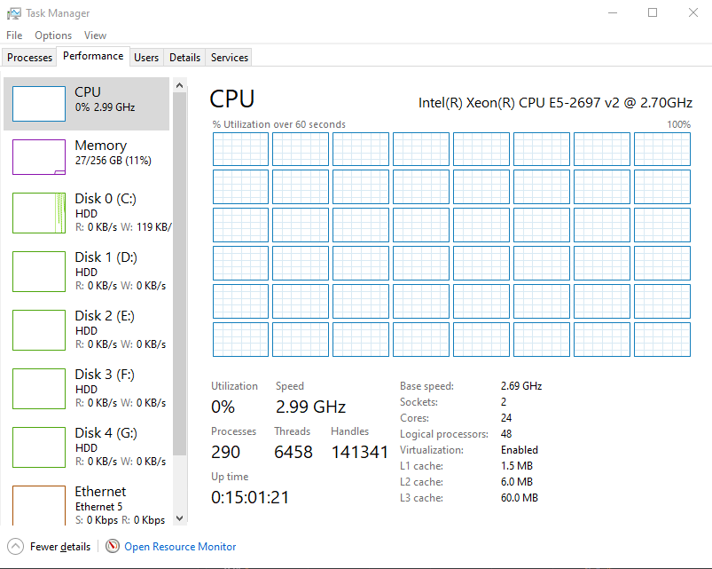

# Prometheus and Grafana Integration

This project sets up **Prometheus** and **Grafana** for effective monitoring and visualization of system metrics. By integrating these two powerful tools, you can gain valuable insights into your application's performance and health.

## Prometheus and Why I Needed Grafana

The server I have is an HP Proliant 380P with 2 sockets and 12 cores for a total of 24 physical cores and 48 logical cores. I publish my websites from this machine. Sometimes the fans were running so much that it was impossible to understand what was happening at that moment. As you can see in the picture, the CPUs were always showing 0. I couldn't see what kind of load the machine was actually under. 

I am a developer. Recently I have been working on artificial intelligence speach to text and text to speach. I needed to measure the performance and cpu ram disk costs of the machine at that moment. This is where the propertheus exporter and the database management and visualization in the graphana timeline structure convinced me. Now I can get detailed analysis of every work I do visually from graphana. This is a good proof method for the applications I develop.



## Overview

- **Prometheus**: An open-source monitoring and alerting toolkit that collects and stores metrics in a time-series database.
- **Grafana**: An open-source analytics platform that visualizes metrics from various data sources, including Prometheus.

## Setup Instructions

### Prerequisites

- Windows Server 2022 (or supported OS)
- Administrative access

### Installation Steps

1. **Install Prometheus**:

   - Download from the [Prometheus website](https://prometheus.io/download/#prometheus).
   - Configure `prometheus.yml` to scrape metrics.
   - Run Prometheus using:
     ```bash
     prometheus.exe --config.file=prometheus.yml
     ```
2. **Install Windows Exporter**:

   - Download the [Windows Exporter](https://github.com/prometheus-community/windows_exporter/releases).
   - Follow the installation prompts to set it up.
3. **Install Grafana**:

   - Download Grafana from the [Grafana website](https://grafana.com/grafana/download).
   - Start Grafana, accessible at `http://localhost:3000`.
4. **Configure Grafana**:

   - Log in with default credentials (admin/admin).
   - Add Prometheus as a data source (URL: `http://localhost:9090`).
   - Create dashboards by selecting metrics with PromQL queries.
5. **Optional - Set Up Alerts**:

   - Configure alerts in Grafana to notify you of critical issues.
   -
