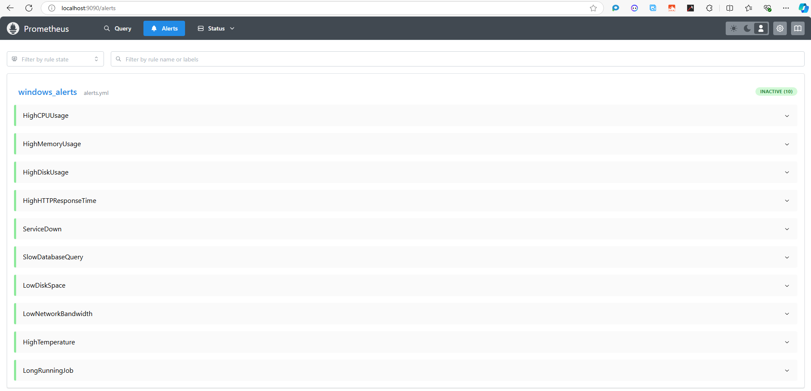

# Step 1 Prometheus Installation

Prometheus is a powerful open-source monitoring and alerting system used to monitor systems and applications. Below is a step-by-step guide for installing Prometheus on Windows Server 2022:

### Step 1: Download Prometheus

1. **Go to the Prometheus Download Page:**

   - Visit the [Prometheus Download Page](https://prometheus.io/download/#prometheus).
2. **Download the Latest Version:**

   - Download the latest version suitable for Windows. Save the ZIP file to your computer.

### Step 2: Extract Prometheus Files

1. **Extract the ZIP File:**

   - Right-click the downloaded ZIP file and extract it. For example, you can extract it to `C:\Prometheus`.
2. **Add to Environment Path:**

   - To make Prometheus accessible from anywhere, add the `C:\Prometheus` directory to your system's environment path. To do this:
     - Right-click on the Start menu and select "System."
     - Go to "Advanced system settings."
     - Click on "Environment Variables."
     - In the "System variables" section, select the "Path" variable and click "Edit."
     - Click "New" and add `C:\Prometheus` to the list.
     - Save the changes and exit.

### Step 3: Configure Prometheus

1. **Open the Configuration File:**

   - Open the `prometheus.yml` file in the extracted directory with a text editor.
2. **Edit the Configuration:**

   - You can update the default settings according to your needs. An example configuration file is as follows:

   ```yaml
   global:
     scrape_interval: 15s  # Default scraping interval

   scrape_configs:
     - job_name: 'windows_exporter'
       static_configs:
         - targets: ['localhost:9182']  # Target for Windows Exporter
     - job_name: 'my_application'
       static_configs:
         - targets: ['localhost:8080']  # Target for your application
   ```

### Step 4: Start Prometheus

1. **Open Command Prompt:**

   - Open Command Prompt (cmd) on Windows.
2. **Run Prometheus:**

   - Navigate to the extracted directory by running the following command:

   ```bash
   cd C:\Prometheus
   ```

   - Start Prometheus with the following command:

   ```bash
   prometheus.exe --config.file=prometheus.yml
   ```

### Step 5: Access the Web Interface

1. **Open Your Browser:**

   - Open your browser and go to the following URL:

   ```
   http://localhost:9090
   ```

   
2. **Prometheus Web Interface:**

   - You will see the Prometheus web interface here. You can query and analyze the metrics you want to monitor.

### Step 6: Install Windows Exporter (Optional)

If you want to monitor your Windows system's metrics in more detail, you can install the Windows Exporter.

1. **Download Windows Exporter:**

   - Visit the [Windows Exporter Download Page](https://github.com/prometheus-community/windows_exporter/releases).
2. **Run the Installer:**

   - Run the installation file you downloaded to install the Windows Exporter.
3. **Check Windows Exporter:**

   - After installing the Windows Exporter, check that it’s working by going to `http://localhost:9182/metrics` in your browser.

### Conclusion

You have successfully installed Prometheus! It is now available for monitoring your system and application metrics. You can integrate visualization tools like Grafana to work alongside Prometheus. If you have any questions or need further assistance, feel free to ask!

---

This updated guide includes the extraction and environment path details as requested. If you need further assistance or modifications, just let me know!
