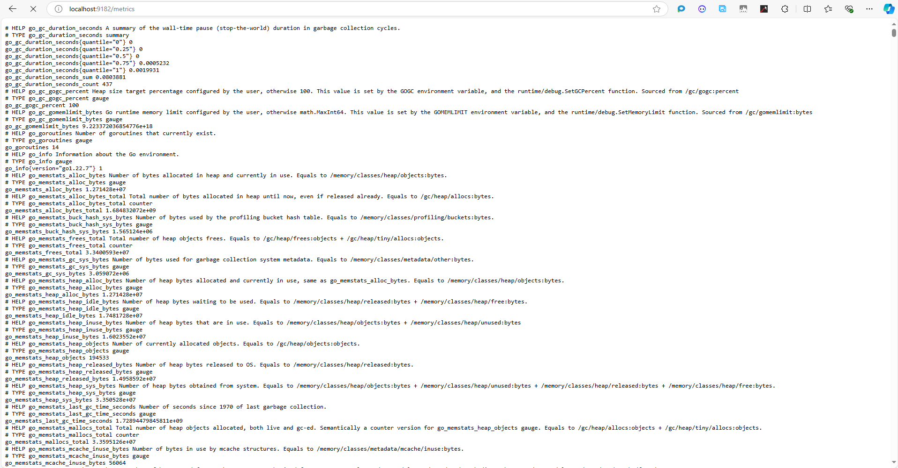

# Install Windows Exporter

## Step 1: Download Windows Exporter

1. **Visit the Windows Exporter Release Page:**

   - Go to the [Windows Exporter GitHub Releases page](https://github.com/prometheus-community/windows_exporter/releases).
2. **Download the Latest Release:**

   - Download the latest release `.msi` file for Windows.

## Step 2: Install Windows Exporter

1. **Run the Installer:**

   - Locate the downloaded `.msi` file and double-click it to run the installer.
2. **Follow the Installation Wizard:**

   - Click "Next" and accept the license agreement.
   - Choose the installation location (default is usually fine).
   - On the features selection screen, ensure that all metrics options you want to monitor are selected.
   - Click "Next" to proceed and then "Install" to start the installation.
3. **Finish the Installation:**

   - Once the installation is complete, click "Finish."

## Step 3: Configure Windows Exporter

1. **Open Command Prompt as Administrator:**

   - Search for "cmd" in the Start menu, right-click on Command Prompt, and select "Run as administrator."
2. **Set Up Windows Exporter Parameters:**

   - To start the Windows Exporter with all parameters, you can use the following command. Make sure to adjust the path if necessary based on your installation directory.

   ```bash
   "C:\Program Files\windows_exporter\windows_exporter.exe" --collectors.enabled "cpu,cs,logical_disk,memory,net,os,system,service" --web.listen-address ":9182" --web.telemetry-path "/metrics"
   ```

   - This command will start the Windows Exporter with all the specified collectors. You can modify the `--collectors.enabled` parameter to include only the metrics you want to monitor.

## Step 4: Verify Windows Exporter

1. **Check if Windows Exporter is Running:**

   - Open your browser and navigate to:

   ```
   http://localhost:9182/metrics
   ```

   - You should see a page displaying various metrics being collected by the Windows Exporter.

   

## Step 5: Configure Windows Exporter to Start Automatically (Optional)

To ensure that Windows Exporter starts automatically when your system boots, you can set it up as a Windows service during installation (if you selected that option). If not, you can manually configure it using the following steps:

1. **Open Services:**

   - Press `Win + R`, type `services.msc`, and press Enter.
2. **Find Windows Exporter:**

   - Locate "windows_exporter" in the list of services.
3. **Set to Automatic:**

   - Right-click on "windows_exporter" and select "Properties."
   - In the "Startup type" dropdown menu, select "Automatic."
   - Click "OK" to save your changes.

## Conclusion

You have successfully installed and started the Windows Exporter with all parameters on your Windows Server. It is now ready to collect metrics for Prometheus. If you need any additional help or have questions, feel free to ask!
