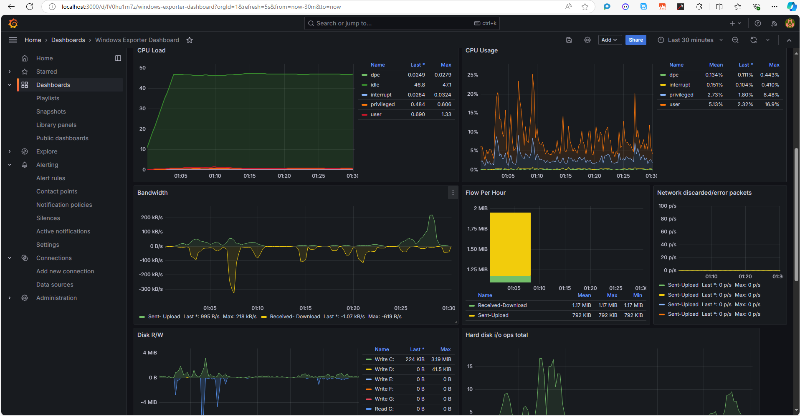

# Install Grafana

### Step 1: Download Grafana

1. **Visit the Grafana Download Page:**

   - Go to the [Grafana Download Page](https://grafana.com/grafana/download).
2. **Download the Windows Installer:**

   - Under the "Windows" section, click on the link to download the latest `.msi` installer file.

### Step 2: Install Grafana

1. **Run the Installer:**

   - Locate the downloaded `.msi` file and double-click it to start the installation.
2. **Follow the Installation Wizard:**

   - Click "Next" to proceed with the installation.
   - Accept the license agreement and click "Next."
   - Choose the installation directory (the default is usually fine) and click "Next."
   - Choose whether to install Grafana as a Windows service. For most cases, leave it checked and click "Next."
   - Click "Install" to begin the installation process.
3. **Complete the Installation:**

   - Once the installation is complete, click "Finish."

### Step 3: Start Grafana

1. **Start Grafana:**

   - If you installed Grafana as a service, it should start automatically. You can verify this by checking the Windows Services.
   - If not, you can manually start it by navigating to the installation directory (e.g., `C:\Program Files\GrafanaLabs\grafana\bin`) and running the following command in Command Prompt:

   ```bash
   grafana-server.exe
   ```

### Step 4: Access the Grafana Web Interface

1. **Open Your Browser:**

   - Open your web browser and navigate to:

   ```
   http://localhost:3000
   ```

   
2. **Log In to Grafana:**

   - The default login credentials are:
     - **Username:** `admin`
     - **Password:** `admin`
   - You will be prompted to change the default password upon your first login.

### Step 5: Configure Data Sources

1. **Add a Data Source:**

   - Once logged in, click on the gear icon (⚙️) on the left sidebar to go to the "Configuration" section.
   - Click on "Data Sources."
   - Click the "Add data source" button.
2. **Select Prometheus:**

   - Choose "Prometheus" from the list of data source options.
3. **Configure Prometheus:**

   - Set the URL to point to your Prometheus server (e.g., `http://localhost:9090`).
   - Click "Save & Test" to verify the connection.

### Step 6: Create a Dashboard

1. **Create a New Dashboard:**

   - Click on the "+" icon (➕) in the left sidebar and select "Dashboard."
   - Click "Add new panel."
2. **Configure the Panel:**

   - In the panel editor, select the data source you configured earlier.
   - Enter a query to fetch the metrics you want to visualize.
   - Customize the visualization options to suit your needs.
3. **Save the Dashboard:**

   - Click on the "Save" icon at the top right corner, give your dashboard a name, and click "Save."

### Conclusion

You have successfully installed Grafana and configured it to work with Prometheus on your Windows machine. You can now create visualizations and dashboards to monitor your metrics effectively. If you have any questions or need further assistance, feel free to ask!
